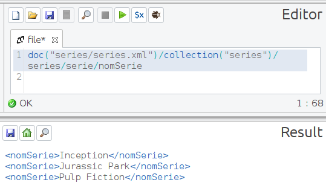

# native-xml-database

# A) Base de datos nativa XML: collection series

```xml
<series>
  <serie>
    <id>123</id>
    <nomDirector>Christopher Nolan</nomDirector>
    <nomSerie>Inception</nomSerie>
    <numEpisodis>1</numEpisodis>
    <paraules_clau>
      <paraula_clau>ciencia ficción</paraula_clau>
      <paraula_clau>sueños</paraula_clau>
      <paraula_clau>acción</paraula_clau>
    </paraules_clau>
    <ultimCapitol>El Origen</ultimCapitol>
  </serie>
  <serie>
    <id>456</id>
    <nomDirector>Steven Spielberg</nomDirector>
    <nomSerie>Jurassic Park</nomSerie>
    <numEpisodis>3</numEpisodis>
    <paraules_clau>
      <paraula_clau>dinosaurios</paraula_clau>
      <paraula_clau>aventura</paraula_clau>
    </paraules_clau>
    <ultimCapitol>Parque Jurásico</ultimCapitol>
  </serie>
  <serie>
    <id>789</id>
    <nomDirector>Quentin Tarantino</nomDirector>
    <nomSerie>Pulp Fiction</nomSerie>
    <numEpisodis>1</numEpisodis>
    <paraules_clau>
      <paraula_clau>crimen</paraula_clau>
      <paraula_clau>drogas</paraula_clau>
    </paraules_clau>
    <ultimCapitol>Bailando en la esquina</ultimCapitol>
  </serie>
</series>
```

1. ¿Cuáles son los nombres de todas las series en el XML?

```sql
doc("series/series.xml")/collection("series")/series/serie/nomSerie
```



1. ¿Cuál es el número de episodios de cada serie en el XML?

```sql
doc("series/series.xml")/collection("series")/series/serie/numEpisodis
```


1. ¿Cuál es el nombre del director de la serie con el id 123?

```sql
doc("series/series.xml")/collection("series")/series/serie[id="123"]/nomDirector
```


1. ¿Cuáles son las palabras clave de la serie "Jurassic Park"?

```sql
doc("series/series.xml")/collection("series")/series/
serie[nomSerie="Jurassic Park"]/paraules_clau/paraula_clau/string()
```


1. ¿Cuál es el último capítulo de cada serie en el XML?

```sql
doc("series/series.xml")/collection("series")/series/serie/ultimCapitol/string()
```


1. ¿Cuántas series tienen más de 2 episodios?

```sql
count(doc("series/series.xml")/collection("series")/series/serie[numEpisodis>2])
```


1. ¿Cuáles son los nombres de las series dirigidas por "Steven Spielberg"?

```sql
doc("series/series.xml")/collection("series")/series/
serie[nomDirector="Steven Spielberg"]/nomSerie/string()
```


1. ¿Cuál es el id de la serie con el último capítulo llamado "El Origen"?

```sql
doc("series/series.xml")/collection("series")/series/
serie[ultimCapitol="El Origen"]/id
```


1. ¿Cuál es el número total de episodios en el XML?

```sql
sum(doc("series/series.xml")/collection("series")/series/serie/numEpisodis)
```


1. ¿Cuál es la serie con más episodios?

```sql
doc("series/series.xml")/collection("series")/series/
serie[numEpisodis = max(/series/serie/numEpisodis)]
```


1. ¿Cuál es el nombre de todas las series que tienen más de 2 palabras clave?

```sql
doc("series/series.xml")/collection("series")/series/serie/
paraules_clau[count(paraula_clau)>2]/../nomSerie/string()
```


1. ¿Cuál es el número total de episodios de todas las series dirigidas por "Christopher Nolan"?

```sql
count(doc("series/series.xml")/collection("series")/series/
serie[nomDirector = "Christopher Nolan"]/numEpisodis)
```


1. ¿Cuál es el nombre de las series que tienen un número impar de episodios?

```sql
doc("series/series.xml")/collection("series")/series/
serie[numEpisodis mod 2 != 0]/nomSerie/string()
```


# B) Base de datos nativa XML: collection escuelas

```xml
<escuelas>
  <escuela id="101" nombre="Instituto Nacional de Educación">
    <direccion ciudad="Madrid" calle="Gran Vía" numero="123"/>
    <alumnos>
      <alumno id="A001" genero="F">
        <nombre>María Pérez</nombre>
        <edad>16</edad>
        <curso>1º Bachillerato</curso>
        <notas>
          <nota asignatura="Matemáticas" calificacion="9"/>
          <nota asignatura="Historia" calificacion="8"/>
          <nota asignatura="Biología" calificacion="7"/>
        </notas>
      </alumno>
      <alumno id="A002" genero="M">
        <nombre>Carlos López</nombre>
        <edad>17</edad>
        <curso>2º Bachillerato</curso>
        <notas>
          <nota asignatura="Matemáticas" calificacion="6"/>
          <nota asignatura="Historia" calificacion="7"/>
          <nota asignatura="Física" calificacion="8"/>
        </notas>
      </alumno>
    </alumnos>
    <profesorado>
      <profesor id="P001" genero="F">
        <nombre>Ana García</nombre>
        <edad>35</edad>
        <asignatura>Matemáticas</asignatura>
      </profesor>
      <profesor id="P002" genero="M">
        <nombre>Juan Fernández</nombre>
        <edad>45</edad>
        <asignatura>Historia</asignatura>
        <asignatura>Teatro</asignatura>
      </profesor>
    </profesorado>
  </escuela>
  <escuela id="102" nombre="Colegio Internacional">
    <direccion ciudad="Barcelona" calle="Diagonal" numero="456"/>
    <alumnos>
      <alumno id="A003" genero="F">
        <nombre>Laura Martínez</nombre>
        <edad>15</edad>
        <curso>4º ESO</curso>
        <notas>
          <nota asignatura="Lengua" calificacion="10"/>
          <nota asignatura="Matemáticas" calificacion="9"/>
          <nota asignatura="Química" calificacion="8"/>
        </notas>
      </alumno>
      <alumno id="A004" genero="M">
        <nombre>David Gómez</nombre>
        <edad>14</edad>
        <curso>3º ESO</curso>
        <notas>
          <nota asignatura="Lengua" calificacion="6"/>
          <nota asignatura="Matemáticas" calificacion="7"/>
          <nota asignatura="Historia" calificacion="8"/>
        </notas>
      </alumno>
    </alumnos>
    <profesorado>
      <profesor id="P003" genero="F">
        <nombre>Carmen Rodríguez</nombre>
        <edad>40</edad>
        <asignatura>Lengua</asignatura>
      </profesor>
      <profesor id="P004" genero="M">
        <nombre>Luis Sánchez</nombre>
        <edad>50</edad>
        <asignatura>Química</asignatura>
      </profesor>
    </profesorado>
  </escuela>
</escuelas>
```

1. ¿Cuáles son los nombres de las escuelas?

```sql
doc("escuelas/escuelas.xml")/collection("escuelas")/escuelas/
escuela/@nombre/string()
```


1. Obtén los nombres de los alumnos del "Instituto Nacional de Educación".

```sql
doc("escuelas/escuelas.xml")/collection("escuelas")/escuelas/
escuela[@nombre="Instituto Nacional de Educación"]/alumnos/alumno/nombre/string()
```


1. ¿Cuál es la edad del profesor que enseña Historia en el "Colegio Internacional"?

```sql
doc("escuelas/escuelas.xml")/collection("escuelas")/escuelas/
escuela[@nombre="Colegio Internacional"]/profesorado/
profesor [@genero="M"]/edad
```


1. Lista los nombres de las asignaturas y las calificaciones de "Carlos López".

```sql
doc("escuelas/escuelas.xml")/collection("escuelas")/escuelas/escuela/
alumnos/alumno[nombre = "Carlos López"]/notas/nota/@asignatura/string() , 
doc("escuelas/escuelas.xml")/collection("escuelas")/escuelas/escuela/alumnos/
alumno[nombre = "Carlos López"]/notas/nota/@calificacion/string()
```


1. ¿Cuántos alumnos hay en total en todas las escuelas?

```sql
count(doc("escuelas/escuelas.xml")/collection("escuelas")/escuelas/
escuela/alumnos/alumno)
```


1. Encuentra los nombres de los profesores que enseñan más de una asignatura.

```sql
doc("escuelas/escuelas.xml")/collection("escuelas")/escuelas/escuela/
profesorado/profesor[count(asignatura > 1)]/nombre/string()
```


1. ¿Cuál es el nombre del alumno más joven en el "Instituto Nacional de Educación"?

```sql
doc("escuelas/escuelas.xml")/collection("escuelas")/escuelas/
escuela[@nombre = "Instituto Nacional de Educación"]/alumnos/
alumno[edad = min(/escuelas/escuela[@nombre = "Instituto Nacional de Educación"]/
alumnos/alumno/edad)]/nombre/string()
```


1. Lista las escuelas que tienen más de 500 estudiantes.

```sql
# opción1
doc("escuelas/escuelas.xml")/collection("escuelas")/escuelas/escuela/
alumnos[count(alumno) > 500]/../@nombre/string()

# opción2
doc("escuelas/escuelas.xml")/collection("escuelas")/escuelas/
escuela[count(alumnos/alumno) > 500]/@nombre/string()
```

1. Obtén los nombres de los alumnos que tienen una calificación igual a 9 en "Matemáticas".

```sql
doc("escuelas/escuelas.xml")/collection("escuelas")/escuelas/escuela/
alumnos/alumno[notas/nota[@asignatura = "Matemáticas" and @calificacion = "9"]]/
nombre/string()
```


1. ¿Cuántas asignaturas enseña cada profesor en el "Instituto Nacional de Educación"?

```sql
doc("escuelas/escuelas.xml")/collection("escuelas")/escuelas/
escuela[@nombre = "Instituto Nacional de Educación"]/profesorado/
profesor/count(asignatura)
```


1. Inserta un nuevo alumno en la clase de "Química" en el "Colegio Internacional".

```sql
# INSERTAR

# XQUF 1
insert node

<alumno id="A005" genero="F">
  <nombre>Susana</nombre>
  <edad>20</edad>
  <curso>1º Bachillerato</curso>
  <notas>
    <nota asignatura="Química" calificacion="7"/>
  </notas>
</alumno>

as last into

doc("escuelas/escuelas.xml")/collection("escuelas")/escuelas/
escuela[@nombre="Colegio Internacional"]/alumnos

# XQUF 2
insert node

<alumno id="A007" genero="M">
  <nombre>Marc</nombre>
  <edad>18</edad>
  <curso>1º Bachillerato</curso>
  <notas>
    <nota asignatura="Química" calificacion="9"/>
  </notas>
</alumno>

as last into

doc("escuelas/escuelas.xml")/collection("escuelas")/escuelas/
escuela[@nombre="Colegio Internacional"]/alumnos

# UPDATE
update insert node

<alumno id="A010" genero="F">
  <nombre>Carla</nombre>
  <edad>21</edad>
  <curso>1º Bachillerato</curso>
  <notas>
    <nota asignatura="Química" calificacion="5"/>
  </notas>
</alumno>

into

doc("escuelas/escuelas.xml")/collection("escuelas")/escuelas/
escuela[@nombre="Colegio Internacional"]/alumnos
```


1. Actualiza la calificación de "David Gómez" en "Historia" en el "Colegio Internacional" a 10.

```sql
# MODIFICAR

# XQUF
replace node

doc("escuelas/escuelas.xml")/collection("escuelas")/escuelas/
escuela[@nombre = "Colegio Internacional"]/alumnos/
alumno[nombre="David Gómez"]/notas/nota[@asignatura = "Historia"]

with

<nota asignatura="Historia" calificacion="10"/>

#update
update replace

doc("escuelas/escuelas.xml")/collection("escuelas")/escuelas/
escuela[@nombre = "Colegio Internacional"]/alumnos/
alumno[nombre="David Gómez"]/notas/nota[@asignatura = "Historia"]

with

<nota asignatura="Historia" calificacion="3"/>
```


1. Borra al alumno con ID A004 del "Instituto Nacional de Educación".

```sql
# DELETE

# XQUF
delete node

doc("escuelas/escuelas.xml")/collection("escuelas")/escuelas/
escuela[@nombre="Colegio Internacional"]/alumnos/alumno[@id="A004"]

# UPDATE
update delete

doc("escuelas/escuelas.xml")/collection("escuelas")/escuelas/
escuela[@nombre="Colegio Internacional"]/alumnos/alumno[@id="A004"]
```

1. Inserta un nuevo profesor de "Música" en el "Colegio Internacional".

```sql
# INSERTAR

# XQUF
insert node

<profesor id="P011" genero="M">
	<nombre>Mónica</nombre>
	<edad>42</edad>
	<asignatura>Música</asignatura>
</profesor>

as last into

doc("escuelas/escuelas.xml")/collection("escuelas")/escuelas/
escuela[@nombre="Colegio Internacional"]/profesorado

# UPDATE
update insert

<profesor id="P011" genero="M">
	<nombre>Mónica</nombre>
	<edad>42</edad>
	<asignatura>Música</asignatura>
</profesor>

into

doc("escuelas/escuelas.xml")/collection("escuelas")/escuelas/
escuela[@nombre="Colegio Internacional"]/profesorado
```


1. Actualiza el nombre del alumno de id=”A001” del "Instituto Nacional de Educación" a “Mari Pérez”.

```sql
# MODIFY

# XQUF
replace node

doc("escuelas/escuelas.xml")/collection("escuelas")/escuelas/
escuela[@nombre = "Instituto Nacional de Educación"]/alumnos/
alumno[@id="A001"]/nombre

with

<nombre>Mari Pérez</nombre>

# UPDATE
update replace

doc("escuelas/escuelas.xml")/collection("escuelas")/escuelas/
escuela[@nombre = "Instituto Nacional de Educación"]/alumnos/
alumno[@id="A001"]/nombre

with

<nombre>Mari Pérez</nombre>
```


1. Borra la asignatura "Historia" del "Instituto Nacional de Educación".

```sql
# DELETE

# XQUF
delete node

doc("escuelas/escuelas.xml")/collection("escuelas")/escuelas/
escuela[@nombre="Instituto Nacional de Educación"]/alumnos/alumno/
notas/nota[@asignatura="Historia"]

# UPDATE
update delete

doc("escuelas/escuelas.xml")/collection("escuelas")/escuelas/
escuela[@nombre="Instituto Nacional de Educación"]/alumnos/alumno/
notas/nota[@asignatura="Historia"]
```


